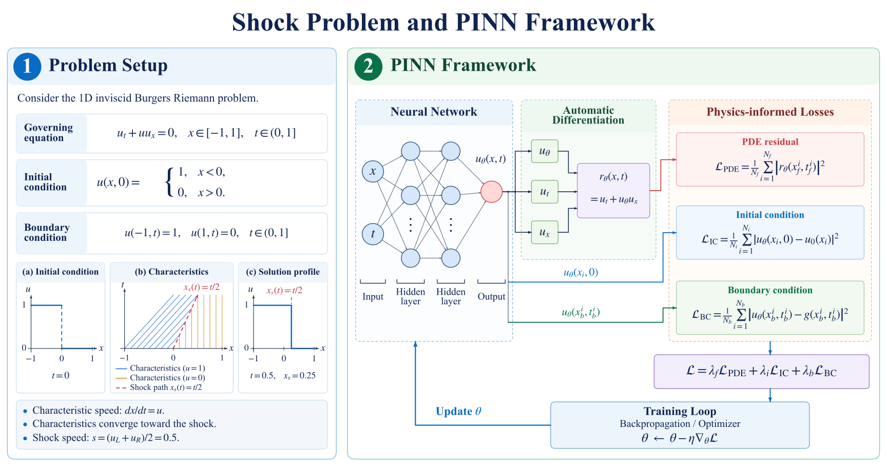

# Burgers PINNs: Standard and Artificial Viscosity

**Yanghao Chen · Tongji University**

Study a moving shock in the one-dimensional Burgers equation with two PyTorch
implementations: a standard physics-informed neural network (PINN) and a PINN
with constant artificial viscosity. Both use the same coordinate-network
architecture and training-point configuration to compare their predicted shock profiles.

[Experiment](#what-one-experiment-contains) · [Problem and data](#problem-and-training-data) · [Network and loss](#network-and-loss) · [Training](#training-strategy) · [Results](#research-results) · [Run the workflow](#install) · [Documentation](#documentation)

- **Problem:** a Riemann initial condition with a shock traveling along $x_s(t)=t/2$.
- **Training:** initial-condition, boundary-condition, and PDE-residual losses, with points generated by the code.
- **Evaluation:** profile plots, shock diagnostics, and animations against the analytical inviscid reference.

## What one experiment contains

One experiment learns a continuous field from a prescribed Riemann problem.
The program generates the training points, optimizes a coordinate network,
and saves its weights, training history, and space-time predictions.

| Component | Contents |
| :--- | :--- |
| Physical problem | Initial jump from 1 to 0 on $x\in[-1,1]$, with $t\in[0,1]$ |
| Training data | Fixed pools of initial, boundary, and interior coordinates |
| Learned field | Coordinate network $(x,t)\mapsto u_\theta(x,t)$ |
| Numerical outputs | Checkpoint, loss-history CSV, metrics JSON, and field arrays |
| Visual outputs | Training-history, sampling, and profile PDFs; prediction GIF |

The **[complete illustrated experiment guide](docs/experiment-guide.md)**
follows a coordinate sample into a training batch, explains the two residuals,
lists all output files, and shows how to read a saved prediction at $t=0.5$.

## Problem and training data

The dimensionless domain is $x\in[-1,1]$, $t\in[0,1]$. The initial state is 1
to the left of zero and 0 to the right. Boundary values remain 1 at the left
boundary and 0 at the right. The inviscid entropy shock moves along $x=t/2$.

### Analytical reference animations

| Burgers shock motion | Burgers shock trajectory |
| :---: | :---: |
|  |  |

These two animations from the research homepage show the analytical inviscid
reference used to interpret the model predictions. On the left, the blue step
is the solution profile and the dashed red line marks its moving discontinuity.
On the right, the teal dashed line is the full path $x_s(t)=0.5t$, the red
segment and dot track its progress, and the orange line marks the current time.
Both advance from $t=0$ to $t=1$ in 61 frames.

[Original static figure](assets/figures/inviscid-shock-reference.png) ·
[Original PDF](assets/pdf/inviscid-shock-reference.pdf). The static reference
shows $t=0.5$, when the shock is at $x=0.25$.

### Training-point generation

An individual training item is a coordinate pair $(x,t)$. The code generates
fixed, uniformly sampled point pools and shuffles them during each epoch.

| Point set | Pool size | Per update | Training target |
| :--- | ---: | ---: | :--- |
| Initial condition (IC) | 4,096 | 128 | Prescribed step at $t=0$ |
| Boundary condition (BC) | 4,096 | 128 | Prescribed values at $x=-1$ and $x=1$ |
| Interior (PDE) | 16,384 | 512 | Zero PDE residual |
| **Total** | **24,576** | **768** | |

Automatic differentiation evaluates the interior residual. The analytical
shock solution is reserved for diagnostics and plots. See
[what goes into a training batch](docs/methods.md#what-goes-into-a-training-batch)
for the coordinates, targets, and loss terms.


[Original sampling-layout PDF](assets/pdf/standard-training-points.pdf).
Orange squares mark initial points at $t=0$, teal triangles mark boundary
points at $x=\pm1$, and blue dots mark interior collocation points. The figure
shows a readable subset of the fixed pools. The dashed red line marks the
analytical shock path $x=t/2$ as a visual reference.

## Network and loss



[Vector SVG](assets/figures/pinn-problem-framework.svg) ·
[PDF](assets/pdf/pinn-problem-framework.pdf) ·
[PNG](assets/figures/pinn-problem-framework.png)

Coordinates enter the network; automatic differentiation supplies the
derivatives for the PDE residual. Initial, boundary, and residual losses train
the same field, with all three weights set to 1. The network drawing is
schematic; the implementation uses eight hidden layers. Artificial viscosity
adds $-\nu u_{xx}$ to the displayed residual.

| Network component | Configuration |
| :--- | :--- |
| Mapping | $(x,t)\mapsto u_\theta(x,t)$ |
| Hidden layers | 8 layers × 64 units, Tanh activation |
| Output | One scalar, linear activation |
| Initialization | Xavier-normal weights, zero biases |
| Trainable parameters | 29,377 |

| Method | Residual used in training |
| --- | --- |
| Standard PINN | $r=u_t+u u_x$ |
| Artificial-viscosity PINN | $r=u_t+u u_x-\nu u_{xx}$, default $\nu=10^{-3}$ |

Automatic differentiation computes the derivatives. Both methods minimize

```math
\mathcal{L}=\mathrm{MSE}_{\mathrm{IC}}+\mathrm{MSE}_{\mathrm{BC}}+\mathrm{mean}(r^2)
```

All three terms have weight 1, and viscosity is a fixed global coefficient.
Training uses the prescribed initial and boundary values together with the PDE
residual; the analytical solution is reserved for evaluation. See
[the method description](docs/methods.md) for the full equations and shock diagnostics.

## Training strategy

| Setting | Shared default |
| :--- | :--- |
| Seed | 1234 |
| Batch | 128 IC + 128 BC + 512 PDE points |
| Epochs / updates | 1,000 / 32,000 |
| Optimizer | Adam |
| Learning rate | Per-update cosine decay from `1e-3` to `1e-5` |
| Training-history diagnostic | Relative L2 on a 401 × 81 grid |
| Final evaluation | 1,001 × 101 grid |
| Saved model | Weights at the final update |


[Original training-history PDF](assets/pdf/standard-training-history.pdf).
Panels show **(a)** total training loss, **(b)** its initial, boundary, and
PDE-residual components, **(c)** relative $L^2$ against the analytical reference,
and **(d)** learning rate. All vertical axes use a logarithmic scale. Panel (a)
is the sum of the three training terms in (b); panel (c) is an evaluation
diagnostic.

## Research results

Both archived runs are evaluated on a **1,001 × 101 space–time grid** against
the inviscid entropy solution. Values below reproduce the recorded reports.

| Diagnostic | Standard PINN | Artificial viscosity, $\nu=10^{-3}$ |
| :--- | ---: | ---: |
| Relative $L^2$ error | 0.158199 | 0.0248065 |
| Mean absolute error | 0.0594167 | 0.00194412 |
| Maximum absolute error | 0.521592 | 0.554839 |
| Mean absolute shock-position error | 0.00112313 | 0.000225788 |
| Mean shock thickness | 0.410108 | 0.00892251 |

Error metrics are lower-is-better. Shock thickness measures the width between
the predicted 0.9 and 0.1 crossings. The artificial-viscosity run has lower
relative $L^2$ and mean absolute errors and a narrower transition, while its
maximum pointwise error is higher. See [Results and provenance](docs/results.md)
for metric definitions and the original reports.


[Original profile-comparison PDF](assets/pdf/standard-solution-comparison.pdf).
The five panels show the same trained standard PINN at
$t=0,0.25,0.5,0.75,1$: the blue step is the inviscid reference, and the red
curve is the prediction. Read the horizontal shift as shock propagation and
the transition width as predicted shock thickness. The
[illustrated results guide](docs/results.md#reading-the-research-figures)
connects each figure to the reported diagnostics.

### Prediction examples

| Standard PINN | Artificial-viscosity PINN, $\nu=0.001$ |
| :---: | :---: |
|  |  |

**Blue: analytical inviscid solution. Red: network prediction.** Each animation
shows one trained model evaluated over physical time, from $t=0$ to $t=1$.
The displayed results come from archived research experiments. For the
artificial-viscosity model, the inviscid solution provides a common reference
for assessing the regularized shock profile.

## Install

The tested environment uses **Python 3.12** and **PyTorch 2.10.0**. Start with
the CPU installation below; training points are generated locally, so no
dataset download is required. Run all commands from the repository root:

```bash
git clone https://github.com/cyhcyh070126-bot/burgers-pinn.git
cd burgers-pinn
```

<details open>
<summary><strong>Windows PowerShell</strong></summary>

```powershell
py -3.12 -m venv .venv
.\.venv\Scripts\python.exe -m pip install torch==2.10.0 --index-url https://download.pytorch.org/whl/cpu
.\.venv\Scripts\python.exe -m pip install -r requirements.txt
.\.venv\Scripts\python.exe -m pip check
```

Activate with `.\.venv\Scripts\Activate.ps1` to use the shorter `python`
commands below. If PowerShell blocks activation, replace `python` in those
commands with `.\.venv\Scripts\python.exe`; no system policy changes are needed.
For example:

```powershell
.\.venv\Scripts\python.exe -m burgers_pinn.train --method standard --output-dir outputs/first-run --device cpu --smoke-test
```

</details>

<details>
<summary><strong>Linux</strong></summary>

```bash
python3.12 -m venv .venv
source .venv/bin/activate
python -m pip install torch==2.10.0 --index-url https://download.pytorch.org/whl/cpu
python -m pip install -r requirements.txt
python -m pip check
```

</details>

For CUDA training or another platform, install the compatible PyTorch build
using the [official PyTorch installation instructions](https://pytorch.org/get-started/locally/)
before installing `requirements.txt`. The installation and execution checks
used a fresh Windows CPU environment.

PDF and GIF generation uses **Times New Roman** and STIX math text.
Use `--skip-plots` for numerical training and evaluation without the plot fonts.

## Quick execution check

After installation, run the commands below to check both methods and reload their saved checkpoints:

```bash
python -m burgers_pinn.train --method standard --output-dir outputs/smoke-standard --device cpu --smoke-test
python -m burgers_pinn.train --method viscosity --output-dir outputs/smoke-viscosity --device cpu --smoke-test
python -m burgers_pinn.evaluate --checkpoint outputs/smoke-standard/checkpoint_final.pt --output-dir outputs/smoke-standard-evaluation --device cpu
python -m burgers_pinn.evaluate --checkpoint outputs/smoke-viscosity/checkpoint_final.pt --output-dir outputs/smoke-viscosity-evaluation --device cpu
```

Each training command writes `checkpoint_final.pt`, `training_history.csv`,
`result.json`, and `evaluation_fields.npz`. Each evaluation command reloads that
checkpoint and writes a new `result.json` and `evaluation_fields.npz`.
Successful runs record `completed: true`; smoke runs and evaluations of smoke
checkpoints also record `smoke_test: true`. Smoke checks use numerical outputs;
the research configuration also supports PDF and GIF generation as described below.

| Configuration | Execution check | Research run |
| :--- | :--- | :--- |
| Hidden layers × width | 2 × 8 | 8 × 64 |
| Epochs / optimizer updates | 2 / 4 | 1,000 / 32,000 |
| Training-point pools | Reduced | 24,576 points |
| Purpose | Verify train, save, and evaluate | Train the full model |

Every train or evaluation command requires a **new output directory** to keep
each experiment's configuration and results together. Choose a new name when
running again.

## Train and evaluate

These commands use the full model and 1,000-epoch training budget.
`--skip-plots` produces numerical outputs without requiring Times New Roman:

```bash
python -m burgers_pinn.train --method standard --output-dir outputs/standard --device auto --skip-plots
python -m burgers_pinn.train --method viscosity --viscosity 0.001 --output-dir outputs/viscosity --device auto --skip-plots
python -m burgers_pinn.evaluate --checkpoint outputs/viscosity/checkpoint_final.pt --output-dir outputs/viscosity-evaluation --device auto --skip-plots
```

`--device auto` selects CUDA when available and CPU otherwise. Use `--device cpu`
to force CPU execution. Full training takes substantially more work than the
smoke check; the terminal reports progress at the diagnostic epochs.

The default budget is 1,000 epochs. Use `--epochs` and `--seed` to configure a
new experiment. Seeds must be integers from 0 to 4,294,967,295.
`configs/formal_defaults.json` documents the default settings; configure runs
through the CLI options, which are listed by `python -m burgers_pinn.train --help`.

| Output | Contents |
| --- | --- |
| `checkpoint_final.pt` | Final model, configuration, viscosity, and sampled points; saved by training |
| `training_history.csv` | Per-epoch losses, learning rate, timing, and relative $L^2$; saved by training |
| `result.json` | Run status, configuration, device, and metrics |
| `evaluation_fields.npz` | Coordinates, predicted field, inviscid reference, and absolute error |

The NPZ file contains `x`, `t`, `prediction`, `truth`, and `absolute_error`.
Field arrays are indexed by time, then space.

See the [illustrated output-file guide](docs/experiment-guide.md#5-what-appears-in-the-experiment-folder)
for exact filenames and a runnable array-reading example, and
[reading a saved evaluation](docs/results.md#reading-a-saved-evaluation)
for array shapes and the connection between field values and profile plots.

To generate the original-style PDFs and GIF, install Times New Roman and omit
`--skip-plots`. Training then also writes three PDFs (history, profiles, and
point layout) and a prediction GIF. Standalone evaluation writes profiles,
point layout when available, and a GIF. Training-history plots use the history
recorded during training.

Training creates `checkpoint_final.pt`; pass that file to the evaluation command
to reload the model with its saved configuration, viscosity, and sampled points.
Each training command initializes a new experiment. The evaluation command
uses a saved model to generate predictions and metrics.

## Documentation

The [complete original-source audit](docs/source-audit.md) records all four
author-provided Burgers scripts, their hashes, separate roles and minimal fixes.
Original bytes are in `source_archive/`; reviewed historical versions are in
`research_scripts/`. The portable scalar workflow above remains the main entry.

| Guide | What it covers |
| :--- | :--- |
| [Illustrated experiment guide](docs/experiment-guide.md) | One experiment from problem setup to saved predictions |
| [Methods](docs/methods.md) | Equations, sampling, losses, and shock diagnostics |
| [Results](docs/results.md) | Archived metrics, figures, and evaluation examples |
| [Reproducibility](docs/reproducibility.md) | Environment and execution checks |
| [Research homepage](https://cyhcyh070126-bot.github.io/) | Project context and related research |

## Repository layout

```text
burgers_pinn/   Model, sampling, residuals, training, evaluation, original plotting
source_archive/ Exact original source snapshots
research_scripts/ Reviewed original research and reference scripts
configs/       Recorded formal defaults
tests/         Numerical and execution-contract checks
assets/        Preserved research GIFs/PDFs and PDF previews for this README
docs/          Illustrated experiment guide, methods, results, and reproducibility
```

Run the numerical and train/save/evaluate checks with
`python -m unittest discover -s tests -v`. See
[Reproducibility](docs/reproducibility.md) for the tested environment and
verification details, and [NOTICE.md](NOTICE.md) for attribution and licensing.
