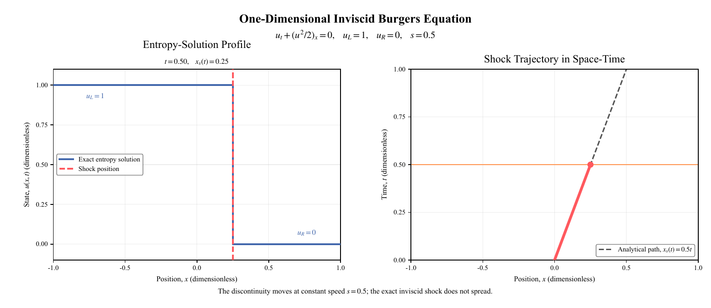

# A complete Burgers PINN experiment

This guide follows one experiment from its prescribed physical problem to
training points, a trained coordinate network, and saved predictions. It covers
the **standard PINN** and **PINN with constant global artificial viscosity**
with the shared default configuration. The research figures illustrate the archived
experiments; the commands produce a new run with its own recorded settings.

[Repository overview](../README.md) · [Equations and methods](methods.md) ·
[Research results](results.md)

## 1. What the network learns

The network represents the dimensionless scalar state $u(x,t)$ on
$x\in[-1,1]$ and $t\in[0,1]$. Its input is a spatial coordinate and a physical
time; its output is one scalar. The prescribed initial state has a jump:

```math
u(x,0)=\begin{cases}1,&x<0,\\0,&x\geq0,\end{cases}
\qquad u(-1,t)=1,\quad u(1,t)=0
```

| Method | Equation imposed at interior training points | Viscosity |
| --- | --- | --- |
| Standard PINN | $u_t+u u_x=0$ | $0$ |
| Artificial-viscosity PINN | $u_t+u u_x-\nu u_{xx}=0$ | Constant $\nu=0.001$ |

Both methods start from these same initial and boundary conditions. The added
viscosity regularizes the equation through the second spatial derivative.
Each method trains its own network.



This original **analytical reference figure** shows the inviscid entropy
solution and its shock trajectory. At the displayed time $t=0.5$, the shock
is at $x=0.25$. The left panel shows the blue step and its red dashed shock
position; the right panel shows the full path in gray dashes, the traversed
path and current position in red, and the current time in orange.

The reference is 1 for $x<t/2$ and 0
otherwise, so the discontinuity moves from $x=0$ at $t=0$ to $x=0.5$ at $t=1$.
It supplies the comparison in the result plots. For the viscosity method,
comparison to this inviscid reference describes the effect of regularization
together with the learned approximation.
[Open the original reference PDF](../assets/pdf/inviscid-shock-reference.pdf).

### Watch the analytical reference evolve

| Solution profile $u(x,t)$ | Shock trajectory in $(x,t)$ |
| :---: | :---: |
|  |  |
| Horizontal axis: position $x$; vertical axis: state $u$. Blue is the exact inviscid step; the red dashed vertical line marks its current shock position. The displayed $t$ is physical time. | Horizontal axis: position $x$; vertical axis: physical time $t$. Teal dashes show the full path; the red segment shows the path already traversed, the red dot marks the current position, and the orange horizontal line marks the current time. |

Both GIFs loop through 61 frames from $t=0$ to $t=1$: the shock moves from
$x=0$ to $x=0.5$ along $x_s(t)=t/2$, while the two states remain 1 and 0.
At $t=0.5$, both views locate the shock at $x=0.25$. These are analytical
reference views; the red markers here indicate the shock, while the red
curves in the [prediction comparisons](#6-connect-predictions-to-the-research-figures)
represent the trained networks. Playback follows physical time, not optimizer
updates or training epochs.

## 2. What one sample, batch, and experiment contain

Here, a **training sample is a coordinate point with a constraint**. The code
generates the coordinates from the domain and prescribed conditions. One
complete experiment contains fixed pools of these points, a network, a
training configuration, and the resulting model and evaluation files.

| Level | What it contains | Role |
| --- | --- | --- |
| One initial or boundary sample | $(x,t)$ and a prescribed scalar value, either 0 or 1 | Match the initial or boundary condition |
| One interior sample | $(x,t)$, where the selected PDE residual is evaluated | Enforce the differential equation |
| One optimizer batch | 128 initial + 128 boundary + 512 interior points | Compute three mean squared losses and take one Adam step |
| One full training pool | 4,096 initial + 4,096 boundary + 16,384 interior points | Supply all 32 batches in each epoch |
| One completed experiment | Configuration, sampled points, final weights, history, field arrays, and diagnostics | Inspect and evaluate the learned solution |

For example, an initial point at $(-0.3,0)$ has target $u=1$, and a boundary
point at $(1,0.6)$ has target $u=0$. At an interior point such as $(0.2,0.6)$,
the learning signal is the PDE residual formed from network derivatives.
These coordinates illustrate the three roles; actual pools are sampled by
the program using the recorded seed.


**Read the figure:** horizontal position is $x$ and vertical position is $t$.
Orange squares carry initial values on $t=0$; teal triangles carry boundary
values at $x=-1$ and $x=1$; blue dots are interior collocation points. The red
dashed line is the reference shock trajectory. The figure displays a subset
of 160 initial, 160 boundary, and 2,400 interior points for legibility.
[Original point-layout PDF](../assets/pdf/standard-training-points.pdf).

The full pools are created once and shuffled each epoch. The initial pool has
2,048 points on each side of zero; each boundary has 2,048 time samples. An
update takes 64 points from each initial side, 64 from each boundary, and
512 paired interior coordinates. All 24,576 points occur once per epoch.

### Tensor shapes in one default update

The implementation stores $x$ and $t$ as separate column tensors, then
concatenates them inside the network.

| Batch entries | Shape of each tensor | Network output or training target |
| --- | --- | --- |
| `x_ic`, `t_ic`, `u_ic` | `(128, 1)` | Initial predictions and prescribed values, both `(128, 1)` |
| `x_bc`, `t_bc`, `u_bc` | `(128, 1)` | Boundary predictions and prescribed values, both `(128, 1)` |
| `x_pde`, `t_pde` | `(512, 1)` | Predicted field and derivative-based residual, both `(512, 1)` |

The network input for any group of $N$ points is therefore `(N, 2)` and its
output is `(N, 1)`. The eight hidden layers each have width 64 and use Tanh;
the last layer is linear. The model has 29,377 trainable parameters.

## 3. How one update becomes a complete training run


[Open the vector PDF](../assets/pdf/pinn-problem-framework.pdf).

Follow the diagram from $(x,t)$ to $u_\theta(x,t)$, then through the three loss
branches to the optimizer. The hidden-layer sketch illustrates connectivity;
the implemented network has the eight 64-unit layers specified above.

For each batch, the network predicts the initial and boundary values.
Automatic differentiation computes $u_t$ and $u_x$ at the interior points;
the viscosity method also computes $u_{xx}$. The selected residual is
$r=u_t+u u_x$ or $r=u_t+u u_x-\nu u_{xx}$.

```math
\begin{aligned}
\mathcal{L}&=\mathcal{L}_{\mathrm{IC}}+\mathcal{L}_{\mathrm{BC}}+\mathcal{L}_{\mathrm{PDE}}\\
\mathcal{L}_{\mathrm{IC}}&=\frac{1}{N_{\mathrm{IC}}}\sum_i\left(u_\theta(x_i,0)-u_i\right)^2\\
\mathcal{L}_{\mathrm{BC}}&=\frac{1}{N_{\mathrm{BC}}}\sum_j\left(u_\theta(x_j,t_j)-u_j\right)^2\\
\mathcal{L}_{\mathrm{PDE}}&=\frac{1}{N_{\mathrm{PDE}}}\sum_k r(x_k,t_k)^2
\end{aligned}
```

Each group contributes its own mean squared loss with weight 1. Adam uses
their sum for one update. The default run repeats 32 updates per epoch for
1,000 epochs, totaling 32,000 updates. The learning rate follows a cosine
schedule from `1e-3` to `1e-5`, updated at every optimizer step.

The analytical solution supplies a separate relative-L2 diagnostic on a
401 by 81 grid at epoch 1, every five epochs, and the final epoch. The saved
model contains the weights at the final optimizer update.


**Read the figure:** panel (a) is total training loss; (b) separates initial,
boundary, and PDE losses; (c) is the reference-error diagnostic; (d) is the
learning rate. Each horizontal axis is training epoch, and the vertical axes
use logarithmic scales. This original figure documents the **standard PINN**.
[Original history PDF](../assets/pdf/standard-training-history.pdf).

## 4. Run the two methods

Follow the [installation instructions](../README.md#install), then run the
commands from the repository root using that Python environment. The
[four-update execution check](../README.md#quick-execution-check) exercises
training, checkpoint saving, and evaluation before a full experiment.

These commands use the full default network, pools, and 1,000-epoch budget:

```bash
python -m burgers_pinn.train --method standard --output-dir outputs/example-standard --device auto --skip-plots
python -m burgers_pinn.train --method viscosity --viscosity 0.001 --output-dir outputs/example-viscosity --device auto --skip-plots
```

Each command creates a new experiment directory. `--device auto` selects CUDA
when available and CPU otherwise; `--device cpu` explicitly selects CPU.
`--skip-plots` produces the numerical files listed below. To also generate the
original-style PDFs and GIF during training, install Times New Roman and run
the command with a fresh output path and without `--skip-plots`.

Evaluate either saved model in a new output directory:

```bash
python -m burgers_pinn.evaluate --checkpoint outputs/example-standard/checkpoint_final.pt --output-dir outputs/example-standard-evaluation --device auto --skip-plots
python -m burgers_pinn.evaluate --checkpoint outputs/example-viscosity/checkpoint_final.pt --output-dir outputs/example-viscosity-evaluation --device auto --skip-plots
```

Evaluation loads the network configuration, weights, and viscosity from the
checkpoint. It queries that trained model on the saved configuration's
evaluation grid. With Times New Roman installed, omitting `--skip-plots`
also creates the profile PDF, point-layout PDF, and prediction GIF.

## 5. What appears in the experiment folder

A numerical training run writes **four files**. Enabling plots adds **three
PDFs and one GIF**, for eight files in total.

| File | Contents | What to use it for |
| --- | --- | --- |
| `checkpoint_final.pt` | Final model weights, full training configuration, global viscosity, fixed training-point pools, format version, and execution-check flag | Reload this experiment with the evaluation command |
| `training_history.csv` | One row per epoch: update count, elapsed seconds, three loss components, total loss, learning rate, and reference-error diagnostic | Read convergence and optimizer history |
| `result.json` | Completion status, method, configuration, device, parameter count, total updates, and final metrics; plot metadata when enabled | Identify the run and read its numerical results |
| `evaluation_fields.npz` | Spatial and temporal vectors, predictions, inviscid reference, and absolute error | Inspect a profile or analyze the space-time field |
| `training_loss_curves.pdf` | Four panels for losses, diagnostic error, and learning rate | View training history |
| `training_point_layout.pdf` | Initial, boundary, and interior points | View where training constraints enter |
| `burgers_solution_comparison.pdf` | Predicted and reference profiles at five physical times | Inspect propagation and transition width |
| `burgers_shock_motion.gif` | Predicted and reference profiles through physical time | View the learned evolution |

Standalone evaluation writes `result.json` and `evaluation_fields.npz`;
with plots enabled it adds the two spatial/point-layout PDFs and the GIF.
Training writes the checkpoint and history; evaluation reloads the saved
model. Choose a new output path for each invocation so its settings and
results stay together.

In `training_history.csv`, the exact column names are `epoch`,
`optimizer_step`, `epoch_elapsed_seconds`, `total_loss`,
`initial_condition_loss`, `boundary_condition_loss`, `pde_residual_loss`,
`relative_l2_fixed_grid`, and `learning_rate`. The reference-error column is
filled at the diagnostic epochs; `nan` marks an epoch when that separate
diagnostic was not evaluated. Losses are averages over the epoch's updates,
`optimizer_step` is cumulative, and `learning_rate` is the rate at the last
update of that epoch.

### Read the saved arrays

Under the full default configuration, `x` has shape `(1001,)`, `t` has shape
`(101,)`, and each field array has shape `(101, 1001)`. The first field index
selects time; the second selects space. For example, row 50 is the spatial
profile at $t=0.5$.

From the repository root, start `python` and paste the following after the
viscosity run above finishes:

```python
import json
from pathlib import Path
import numpy as np

run = Path("outputs/example-viscosity")
report = json.loads((run / "result.json").read_text(encoding="utf-8"))
print(report["completed"], report["method"])
print(report["configuration"]["global_viscosity"])
print(report["metrics"]["relative_l2_fixed_grid"])

with np.load(run / "evaluation_fields.npz") as fields:
    x = fields["x"]
    t = fields["t"]
    index = int(np.argmin(np.abs(t - 0.5)))
    prediction = fields["prediction"][index, :]
    reference = fields["truth"][index, :]
    absolute_error = fields["absolute_error"][index, :]
    print("Physical time:", float(t[index]))
    print("Profile shape:", prediction.shape)
    print("Mean absolute error at this time:", float(absolute_error.mean()))
```

The profile mean in this snippet concerns one physical time. The metrics
recorded in `result.json` summarize the full evaluation grid; shock-position
and thickness summaries use its positive-time slices.

## 6. Connect predictions to the research figures


The five panels query one trained standard network at
$t=0,0.25,0.5,0.75,1$. Blue is the inviscid reference; red is the network
prediction. Their reference shock positions are $x=0,0.125,0.25,0.375,0.5$.
These curves show the same kind of spatial profiles extracted from the saved
field arrays above. The displayed figure comes from the archived experiment.
[Original profile PDF](../assets/pdf/standard-solution-comparison.pdf).

| Standard PINN | Artificial-viscosity PINN, $\nu=0.001$ |
| --- | --- |
|  |  |

The archived GIFs advance through **physical time**, with the same blue
reference and red prediction convention. They show the standard and viscosity
experiments separately. A trained network is queried at successive times to
form each animation.

Read the curves together with the [recorded diagnostics](results.md#recorded-diagnostics):
relative L2 and mean absolute error describe the full field; the downward
crossing of $u=0.5$ estimates shock position; the distance between the
$u=0.9$ and $u=0.1$ crossings measures transition thickness. All quantities
use the dimensionless coordinates of this benchmark.

For original figure sources and file hashes, see the
[asset provenance](assets-provenance.json). The [methods page](methods.md)
gives the detailed equations, and [reproducibility notes](reproducibility.md)
record the installation and execution checks.
