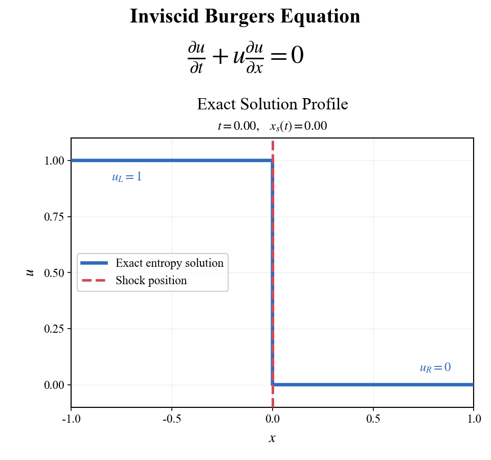
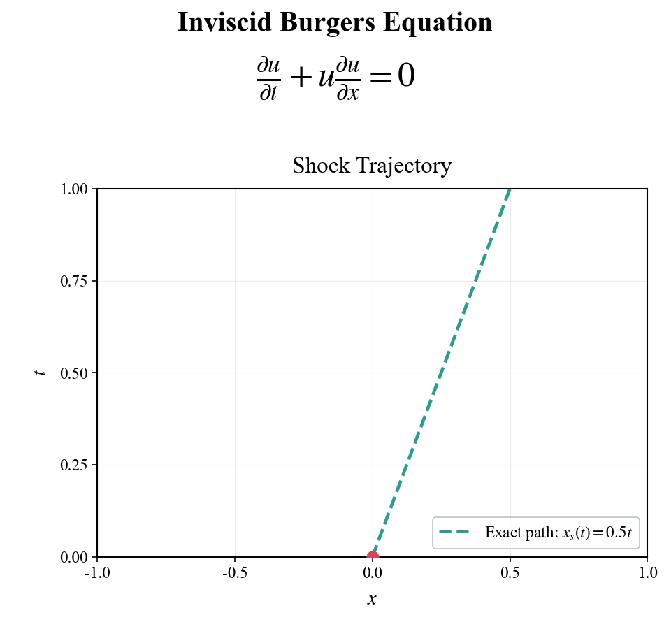
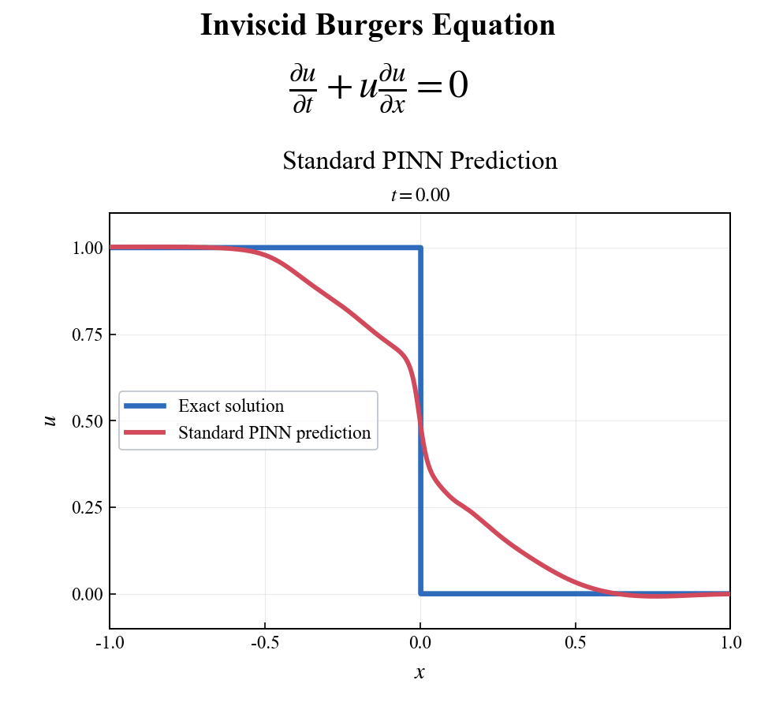
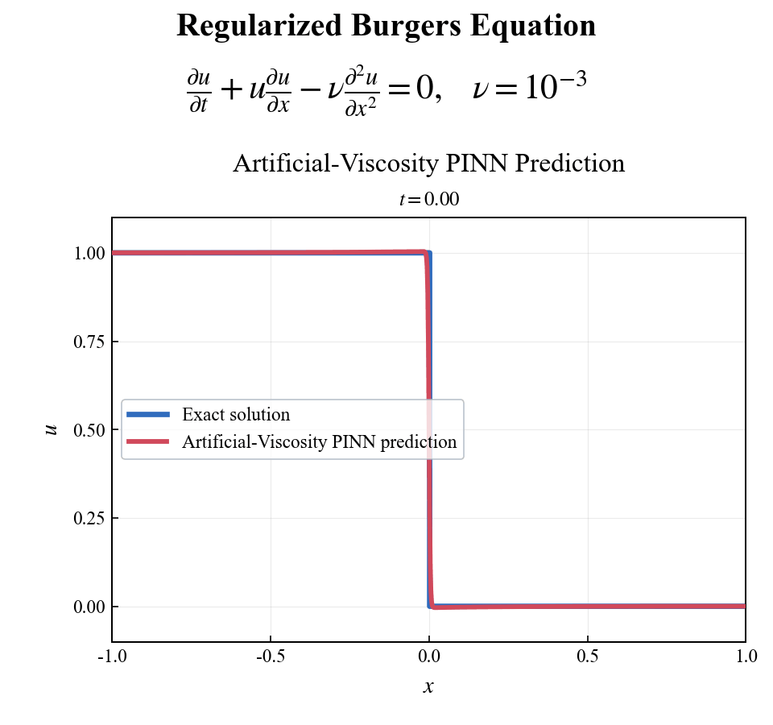
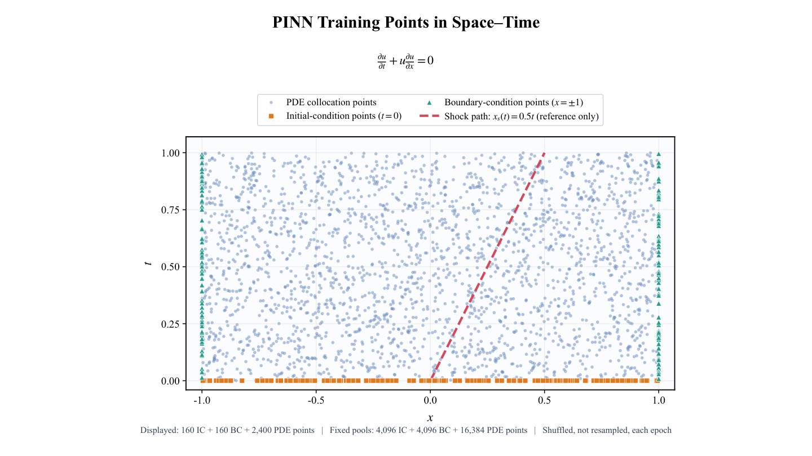
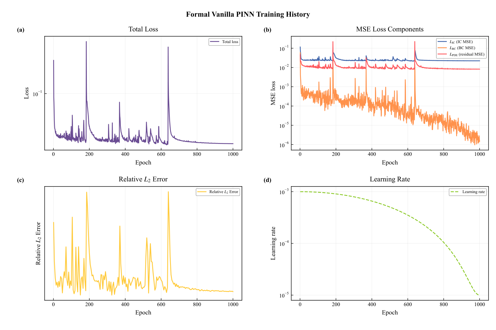
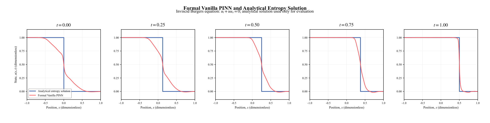

# Research results and visual provenance

The prediction figures and reported metrics come from archived 1,000-epoch
experiments. Analytical-reference animations illustrate the prescribed problem.
The repository includes prediction animations, original PDF figures,
and recorded diagnostics. For a new experiment, use the full training commands
in the [README](../README.md#train-and-evaluate).

The [illustrated experiment guide](experiment-guide.md) connects the problem,
training points, optimizer batches, and output files to these figures. It also
includes a Python example for reading a saved profile from a new run.

## Problem and comparison

Both runs use the Riemann initial condition $u(x,0)=1$ for $x<0$ and $0$
otherwise, with $u(-1,t)=1$ and $u(1,t)=0$ on
$x\in[-1,1]$, $t\in[0,1]$.

- **Standard PINN:** strong residual $u_t+u u_x=0$.
- **Artificial-viscosity PINN:** strong residual
  $u_t+u u_x-\nu u_{xx}=0$, with constant $\nu=10^{-3}$.

The reference is the **inviscid entropy solution**, whose discontinuity travels
along $x_s(t)=0.5t$. The reference is reserved for evaluation and visual
comparison. For the artificial-viscosity PDE, the distance to this inviscid
reference is a diagnostic of regularization. The GIF label “Exact solution”
denotes this inviscid reference in both panels.

## Analytical reference animations

| Exact shock profile | Exact shock trajectory |
| :---: | :---: |
|  |  |

These unchanged homepage GIFs show the reference from two perspectives. The
profile view plots $u$ against $x$; the trajectory view plots $t$ against $x$.
The discontinuity advances from $x=0$ to $x=0.5$ as time advances from 0 to 1.
Both files contain 61 frames at 100 ms per frame, on a 960 by 900 pixel canvas.
They provide the analytical baseline for the two learned solutions below.

## Preserved prediction animations

| Standard PINN | Artificial-viscosity PINN, $\nu=10^{-3}$ |
| --- | --- |
|  |  |

These animations are preserved from the author's personal homepage. Each has
61 frames, a 960 by 900 pixel canvas, and a 100 ms frame duration. Their method
labels and equations correspond to the archived result reports and experiment index.

Read each animation as a sequence of spatial profiles from one trained model.
The horizontal axis is position $x$ and the vertical axis is the scalar state
$u$. The title reports physical time $t$, advancing from 0 to 1. **Blue shows
the inviscid entropy solution; red shows the network prediction.** The blue
step moves right from $x=0$ to $x=0.5$. The red curve shows both the predicted
shock position and the shape of the transition between the two states.
Playback illustrates physical evolution; training progress appears in the
separate history figure below.

## Recorded diagnostics

The archived reports evaluate a fixed grid of **1001 spatial points by 101 time
points**. The table reproduces the diagnostics recorded in those reports.

| Diagnostic against the inviscid entropy reference | Standard PINN | Artificial viscosity, $\nu=10^{-3}$ |
| --- | ---: | ---: |
| Relative $L^2$ error | 0.158199 | 0.0248065 |
| Mean absolute error | 0.0594167 | 0.00194412 |
| Maximum absolute error | 0.521592 | 0.554839 |
| Mean absolute shock-location error | 0.00112313 | 0.000225788 |
| Maximum absolute shock-location error | 0.00194988 | 0.000481546 |
| Mean predicted shock thickness | 0.410108 | 0.00892251 |
| Maximum predicted shock thickness | 0.718692 | 0.00899506 |

Shock location is the leftmost downward crossing of the predicted value 0.5,
with a nearest-value fallback if no crossing exists. Shock thickness is the
distance between the predicted 0.9 and 0.1 crossings. These are dimensionless
quantities. Maximum pointwise error is sensitive to the discontinuity and should
be read alongside the integrated and shock diagnostics.

Relative $L^2$ is the Euclidean norm of the error over the full space-time grid,
divided by the norm of the inviscid reference. Mean and maximum absolute errors
also use that full grid. Shock-position and thickness summaries use the
100 positive-time slices, $t=0.01,0.02,\ldots,1$; the initial profile at $t=0$
is included in the field-error metrics. These complementary quantities
describe the overall field, shock trajectory, and transition width.

Both reports specify seed 1234, eight hidden layers of width 64 with Tanh
activations, 29,377 trainable parameters, and 1000 training epochs. Fixed pools
contain 4096 initial-condition, 4096 boundary-condition, and 16,384 PDE points.
The batch sizes are 64 per initial-condition side, 64 per boundary, and 512
interior collocation points: 768 points per optimizer update. The recorded
learning-rate range is $10^{-3}$ to $10^{-5}$. The training-history diagnostic
is evaluated at epoch 1, every five epochs, and the final epoch.

## Reading the research figures

The following figures document the **standard PINN** experiment. In the
preserved figure titles, “Formal Vanilla PINN” denotes this standard method.
The PNG previews are page renderings of the linked original PDFs.

### Where the training information enters

The horizontal axis is space and the vertical axis is time. **Orange squares**
on $t=0$ carry the prescribed initial values. **Teal triangles** on $x=-1$ and
$x=1$ carry the boundary values. **Blue dots** are interior coordinates at
which the PDE residual is evaluated. The red dashed line $x=t/2$ shows the
analytical reference trajectory.

The plot displays 160 initial, 160 boundary, and 2,400 interior points for
legibility. Training uses all 4,096 initial, 4,096 boundary, and 16,384 interior
points in fixed pools, shuffled each epoch. The
[training-batch description](methods.md#what-goes-into-a-training-batch)
connects these three groups to the loss terms.
[Open the original sampling-layout PDF](../assets/pdf/standard-training-points.pdf).

### Training history: loss, reference error, and learning rate

All panels share training epoch on the horizontal axis and use logarithmic
vertical axes.

| Panel | What is plotted | How to read it |
| --- | --- | --- |
| (a) Total loss, purple | Sum of the initial, boundary, and PDE-residual mean squared losses | Tracks the objective optimized by Adam; each point is an epoch average |
| (b) Loss components | Initial loss in blue, boundary loss in orange, and interior residual loss in red | Shows how the three training constraints contribute to the total |
| (c) Relative $L^2$, yellow | Prediction error against the inviscid reference on a 401 × 81 grid | Tracks agreement with the reference at diagnostic epochs; it is evaluated separately from the training objective |
| (d) Learning rate, dashed green | Cosine schedule from `1e-3` to `1e-5` | Shows the optimizer step size recorded at the end of each epoch |

The history figure follows optimization over epochs; the prediction animations
follow the final learned solution over physical time. Read panels (a) and (b)
together to relate the total objective to its components, then use panel (c)
and the spatial profiles to examine the resulting field.
[Open the original training-history PDF](../assets/pdf/standard-training-history.pdf).

### Spatial profiles at five times

From left to right, the panels show $t=0,0.25,0.5,0.75,1$. Each panel queries
the same trained network at a different time. The **blue step** is the
inviscid entropy solution and the **red curve** is the standard PINN.

The reference shock locations are $x=0,0.125,0.25,0.375,0.5$. Comparing these
positions with the red curve's $u=0.5$ crossing illustrates the shock-location
diagnostic. The horizontal distance between its $u=0.9$ and $u=0.1$ crossings
illustrates predicted shock thickness. In this standard-PINN experiment, the
learned transition becomes narrower at later physical times, as the panels
and animation show.
[Open the original profile-comparison PDF](../assets/pdf/standard-solution-comparison.pdf).

The PDFs are unmodified, single-page originals with selectable text and their
original layout and typography.

## Reading a saved evaluation

A new training or evaluation run writes `result.json` for scalar diagnostics
and `evaluation_fields.npz` for the field values behind the profile plots.
With the default final grid, the arrays have the following meanings:

| Array | Shape | Meaning |
| --- | --- | --- |
| `x` | `(1001,)` | Spatial coordinates from −1 to 1 |
| `t` | `(101,)` | Physical times from 0 to 1 |
| `prediction` | `(101, 1001)` | Network values, indexed as `[time_index, space_index]` |
| `truth` | `(101, 1001)` | Inviscid entropy reference on the same grid for either method |
| `absolute_error` | `(101, 1001)` | Elementwise absolute difference between prediction and reference |

For example, `prediction[50, :]` is the profile at $t=0.5$, plotted against
`x`; `truth[50, :]` supplies its blue reference curve. The smaller smoke-test
grid uses the same array ordering. Each saved checkpoint records its model
configuration and sampled training points, so the evaluation command can
reconstruct the corresponding field and point-layout plots.

## Asset provenance

The [provenance manifest](assets-provenance.json) records SHA-256 hashes for every
copied asset and original result report, the selected configuration, and the
reported metrics. Together, these records link the displayed results to the
standard and constant-global-viscosity experiments.
